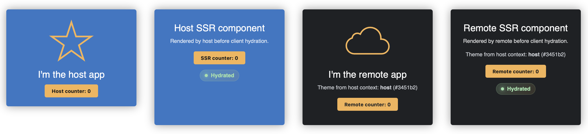

# TanStack Start UI

Example UI showing a host page with remote widgets rendered into the same view.

## Getting started

From this directory:

```bash
pnpm build
pnpm preview
```

Open http://localhost:4173/

## UI

- **Host app card** — blue card with a star icon and a host-only counter.
- **Host SSR card** — blue card with copy that appears before hydration, then shows a clickable counter and a status badge.
- **Remote app card** — dark card with a cloud icon, the host theme label/colour, and a remote counter.
- **Remote SSR card** — dark card with pre-hydration copy, the host theme label/colour, a counter after hydration, and a status badge.
- **Status badges** — cards start as `SSR`, then switch to `Hydrated` after the page becomes interactive.
- **Counters** — each counter increments independently.


