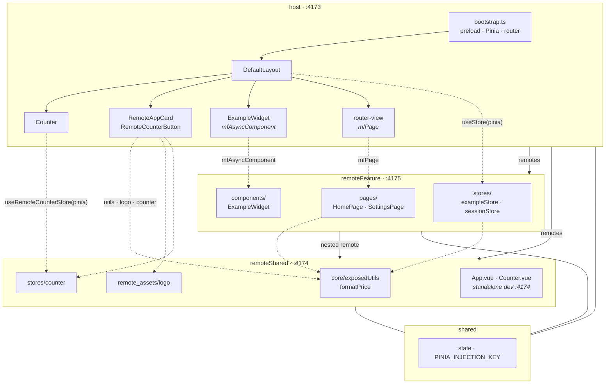

# Vue 3 microfrontends with Module Federation

A **production-oriented** Vue 3 example: one host shell, a feature remote, and a shared remote with a nested dependency chain. It shows how to wire routing, Pinia, lazy-loaded pages/widgets, and shared utilities across MF boundaries using `@module-federation/vite`.

This is not a minimal demo. The host includes patterns commonly needed in real apps: bootstrap preload, explicit Pinia wiring, MF runtime helpers, and host-side wrappers where federated `.vue` components cannot safely rely on `inject()`.

## Architecture

### Federation topology



Solid arrows — Module Federation `remotes` links. Dashed arrows — runtime imports from the host layout or nested remote code.

| App              | Federation name | Port | Responsibility                                      |
| ---------------- | --------------- | ---- | --------------------------------------------------- |
| `host`           | `host`          | 4173 | Shell: router, layout, bootstrap, shared Pinia      |
| `remote`         | `remoteShared`  | 4174 | Shared libs: formatting utils, counter store, logo  |
| `remote-feature` | `remoteFeature` | 4175 | Feature area: pages, widgets, feature Pinia stores  |
| `shared`         | —               | —    | Cross-app runtime (`state`, `PINIA_INJECTION_KEY`)  |

`remoteFeature` depends on `remoteShared` (nested remote). The host talks to both remotes directly.

## Repository layout

```text
vue/
├── host/                 # Shell application
│   └── src/
│       ├── bootstrap.ts          # Pinia, preload, router, mount
│       ├── pinia.ts              # Single Pinia instance for the shell
│       ├── router.ts             # Routes + mfPage() for remote pages
│       ├── layouts/DefaultLayout.vue
│       ├── components/
│       │   ├── Counter.vue             # Host card counter (uses remote store)
│       │   ├── RemoteAppCard.vue       # Remote-style card (host component)
│       │   └── RemoteCounterButton.vue
│       └── utils/
│           ├── mfResolveRemote.ts
│           ├── mfImport.ts
│           ├── mfPage.ts
│           └── mfAsyncComponent.ts
├── remote/               # remoteShared
│   └── src/
│       ├── stores/counter.ts
│       ├── core/exposedUtils.ts
│       ├── remote_assets/logo.svg
│       ├── components/Counter.vue      # Standalone dev on :4174 only
│       └── App.vue                     # Standalone remote dev shell
├── remote-feature/       # remoteFeature
│   └── src/
│       ├── stores/exampleStore.ts
│       ├── stores/sessionStore.ts
│       ├── pages/HomePage.vue
│       ├── pages/SettingsPage.vue
│       └── components/ExampleWidget.vue
└── shared/shared.ts
```

## What each remote exposes

**`remoteShared`** (`remote/`)

| Expose                     | Module                          |
| -------------------------- | ------------------------------- |
| `./stores/counter`         | Shared Pinia store (`id: store`) |
| `./core/exposedUtils`      | `formatPrice` and shared helpers |
| `./format-utils`           | Legacy alias for format utils    |
| `./remote_assets/logo`     | SVG asset URL                    |
| `./components/Counter`     | For standalone `remote` dev      |
| `./remote-app`             | Standalone `App.vue` on :4174    |

**`remoteFeature`** (`remote-feature/`)

| Expose                        | Module                |
| ----------------------------- | --------------------- |
| `./stores/exampleStore`       | Feature store         |
| `./stores/sessionStore`       | Session store         |
| `./pages/HomePage`            | `/workspace` page     |
| `./pages/SettingsPage`        | `/settings` page      |
| `./components/ExampleWidget`  | Layout widget         |

The host does not expose modules; it only consumes remotes.

## Host UI (`DefaultLayout`)

- **Header** — navigation (`/workspace`, `/settings`) and labels from remote Pinia stores (`useExampleStore(pinia)`, `useSessionStore(pinia)`).
- **Host card** — local shell UI with `Counter` (star icon, “I'm the host app”).
- **Remote card** — `RemoteAppCard`: logo and price from `remoteShared`, counter via `RemoteCounterButton`.
- **Widget** — `ExampleWidget` loaded with `mfAsyncComponent()`.
- **Main** — `<router-view />` renders remote pages.

Both counter buttons on the host share **one** Pinia store (`remoteShared/stores/counter`) on the host's singleton Pinia. Clicking either button updates the same value on both cards.

## Routes

| Path         | Component      | Source                          |
| ------------ | -------------- | ------------------------------- |
| `/`          | → `/workspace` | host redirect                   |
| `/workspace` | `HomePage`     | `remoteFeature/pages/HomePage`  |
| `/settings`  | `SettingsPage` | `remoteFeature/pages/SettingsPage` |

The layout is a lazy host component. Page components come from `remoteFeature` via `mfPage()`.

## Production patterns used in the host

### 1. Bootstrap preload (`bootstrap.ts`)

Remote modules that are imported **statically** in the layout must be warmed up before the layout mounts:

```ts
await mfImport("remoteShared/core/exposedUtils", () => import("remoteShared/core/exposedUtils"));
await mfImport("remoteFeature/stores/exampleStore", () => import("remoteFeature/stores/exampleStore"));
await mfImport("remoteShared/stores/counter", () => import("remoteShared/stores/counter"));
// ...
```

Without preload, static `import("remoteFeature/stores/...")` in `DefaultLayout` can run before nested remotes are ready.

### 2. Shared Pinia singleton (`pinia.ts`)

One `createPinia()` on the host. Remote stores are always called with an explicit instance:

```ts
const store = useExampleStore(pinia);
```

Do not rely on `useStore()` without arguments inside federated `.vue` files loaded on the host — the remote bundle may use a different Pinia copy.

### 3. Host wrappers instead of federated widgets (when needed)

`RemoteAppCard` and `RemoteCounterButton` live on the host but consume remote modules (store, utils, assets) via static MF imports. This avoids Pinia/`inject()` issues across bundle boundaries while keeping the same UX as a federated card.

`remote/components/Counter.vue` remains for running `remoteShared` standalone on port 4174.

### 4. MF runtime helpers (`host/src/utils/`)

| Helper              | Use case                                      |
| ------------------- | --------------------------------------------- |
| `mfResolveRemote`   | Await `__mf_remote_pending`, unwrap `default` |
| `mfImport`          | Preload / eager remote modules                |
| `mfPage`            | Lazy route components from remotes            |
| `mfAsyncComponent`  | Lazy widgets (e.g. `ExampleWidget`)           |

Async loaders must return the **component directly**, not `{ default: component }`, unless the module is a real ES module with `__esModule`.

### 5. Shared dependencies

`vue` and `pinia` are configured as **singletons** on all three apps. The host also shares `vue-router` (eager on the shell).

## Getting started

From the repository root:

```bash
pnpm install
pnpm run vue:dev
```

Or from this directory:

```bash
pnpm run dev
```

Open http://localhost:4173/

All three dev servers must be running:

- `remoteShared` — http://localhost:4174
- `remoteFeature` — http://localhost:4175
- `host` — http://localhost:4173

**Expected behaviour:** header shows remote store labels, both cards share one counter, the widget renders, `/workspace` and `/settings` show remote pages.

## Build

```bash
pnpm run vue:build
pnpm run vue:preview
```

## Adapting this to your app

1. **Split by bounded context** — shared remote for cross-team libs/stores; feature remotes for routes and UI areas.
2. **Preload before static imports** — list every remote module imported at the top level of layout/shell components in `preloadMfRemotes()`.
3. **Pass `pinia` explicitly** — treat remote stores like shared services; one shell instance, explicit `useStore(pinia)`.
4. **Prefer host wrappers** for remote UI that needs shell context (auth, Pinia, router) instead of loading raw remote `.vue` trees.
5. **Keep MF helpers** — centralise pending-module handling and default unwrapping in one place (`mfResolveRemote`).

## Plugin version

This example uses `@module-federation/vite` from `pkg.pr.new/@module-federation/vite@34aaea5` in all three Vue apps. Pin to a stable npm release in your own project once your MF graph is validated.
